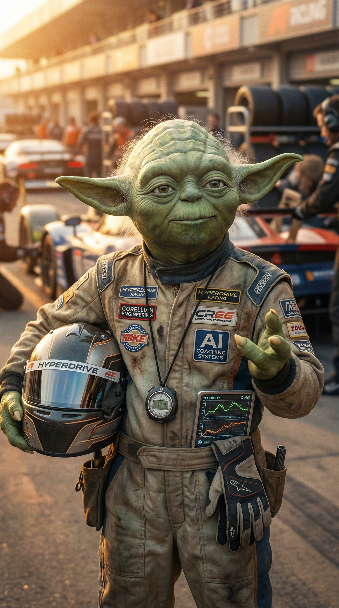

# Documentation: Master Lonn iRacing Learning System

This directory contains comprehensive documentation for the iRacing learning system, including analysis, enhancement proposals, and implementation guides.

---

## 📚 Documentation Index

### Core Analysis

#### [iRacing Progress Review](./iracing_progress_review.md)
Comprehensive review of Master Lonn's Week 01 progress, analyzing the learning journey, system effectiveness, and proposed advancements.

**Key Topics:**
- Week 01 performance analysis
- Learning system strengths
- Advancement suggestions grounded in learning science
- Little Padawan coaching philosophy

#### [Data Structure Analysis](./data_structure_analysis.md)
Deep technical analysis of the current data structures, workflows, and dependencies.

**Key Topics:**
- Current frontmatter structure
- Data flow and processing
- Integration points and risks
- Dependency mapping

---

### Implementation Guides

#### [Technical Implementation Guide](./technical_implementation_guide.md)
Complete technical specifications for implementing the proposed learning science enhancements.

**Covers 8 Major Enhancements:**
1. Mental Rehearsal Protocol
2. Visual Scanning Training
3. Situation Anticipation Drills
4. Interleaved Practice Sessions
5. Spaced Repetition System
6. Hypothesis Testing Framework
7. Cross-Session Pattern Dashboard
8. Adaptive Coaching Persona

**For Each Enhancement:**
- Data schemas (YAML/TOML)
- Python implementation code
- Makefile integration
- Visualization examples
- Configuration specifications

#### [Integration Strategy](./integration_strategy.md)
Zero-disruption migration plan for integrating new data schemas into the existing system.

**Key Topics:**
- Backward compatibility strategy
- Frontmatter extension approach
- Safe update mechanisms
- Phased migration plan
- Testing and rollback strategies
- Risk assessment

#### [Usage Scenarios](./usage_scenarios.md)
Practical, step-by-step examples of how to use the new enhancement tools in daily and weekly workflows.

**Scenarios:**
- Full race day workflow with new tools
- Weekly review workflow
- Planning an interleaved practice session

---

## 🎯 Quick Start

### For Understanding the System

1. Start with **[iRacing Progress Review](./iracing_progress_review.md)** to understand the learning philosophy and current state
2. Review **[Data Structure Analysis](./data_structure_analysis.md)** to understand how the system works

### For Implementing Enhancements

1. Read **[Integration Strategy](./integration_strategy.md)** to understand the zero-risk approach
2. Follow **[Technical Implementation Guide](./technical_implementation_guide.md)** for step-by-step implementation
3. Reference **[Usage Scenarios](./usage_scenarios.md)** for practical examples

---

## 🏗️ Implementation Roadmap

### Phase 1: Foundation (Weeks 2-3)
**Effort:** 7-10 hours

- Mental Rehearsal Protocol
- Hypothesis Testing Framework
- Spaced Repetition System

### Phase 2: Skill Training (Weeks 4-6)
**Effort:** 9-12 hours

- Visual Scanning Training
- Situation Anticipation Drills
- Interleaved Practice Sessions

### Phase 3: Analytics (Weeks 7-9)
**Effort:** 7-9 hours

- Season Dashboard
- Adaptive Coaching Persona

**Total Estimated Effort:** 23-31 hours over 7-9 weeks

---

## 🧠 Learning Science Principles

The enhancements are grounded in evidence-based learning science:

- **Mental Rehearsal:** Neuroplasticity and motor imagery research
- **Spaced Repetition:** Ebbinghaus forgetting curve and optimal review intervals
- **Interleaved Practice:** Contextual interference effect for long-term retention
- **Hypothesis Testing:** Scientific method applied to skill acquisition
- **Deliberate Practice:** Ericsson's framework for expert performance

---

## 🤖 Little Padawan: The AI Coach



Little Padawan is the adaptive AI coaching persona designed to guide Master Lonn through the learning journey. The coaching philosophy emphasizes:

- **Questions over prescriptions:** Socratic method for deeper understanding
- **Data-driven insights:** Connect telemetry to subjective experience
- **Honest feedback:** Celebrate real wins, acknowledge real challenges
- **Adaptive tone:** Context-aware coaching based on performance trends

---

## 📊 System Architecture

```
master-lonn-iracing-s1-2026/
├── weeks/                  # Weekly logs with event data
│   └── weekXX/
│       ├── README.md       # Week summary
│       ├── events/         # Individual event markdown files
│       ├── data/           # CSV telemetry exports
│       └── images/         # Generated visualizations
├── tracks/                 # Track dossiers
├── coaching/               # AI coaching memory
├── tools/                  # Python automation scripts
├── docs/                   # THIS DIRECTORY
├── config.toml             # Central configuration
└── Makefile                # Workflow commands
```

---

## 🔧 Key Technologies

- **Python 3.11** with pandas, matplotlib, seaborn
- **TOML/YAML** for configuration and data
- **Markdown** for documentation
- **Makefile** for workflow automation
- **Git** for version control
- **Garage61** as external telemetry source

---

## 📝 Contributing

This documentation is living and will evolve as the system grows. When adding new features:

1. Document the data schema
2. Provide implementation code
3. Add usage examples
4. Update this README

---

## 📅 Version History

- **v1.0** (2025-12-19): Initial comprehensive documentation
  - Progress review for Week 01
  - Technical implementation guide for 8 enhancements
  - Integration strategy with zero-disruption approach
  - Usage scenarios and examples

---

## 🙏 Acknowledgments

This learning system is inspired by:

- **Deliberate Practice** research by K. Anders Ericsson
- **Learning science** principles from cognitive psychology
- **Motorsport expertise** development research
- **Data-driven coaching** methodologies

---

**Author:** Manus AI  
**Date:** December 19, 2025  
**License:** MIT (or as specified in repository root)
