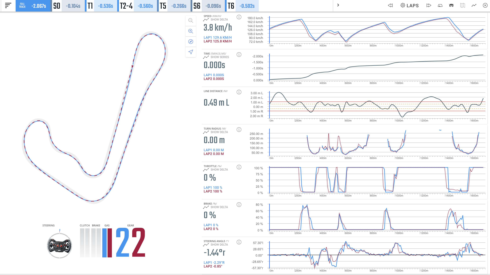

# Week 01 – Summit Point Raceway – Jefferson Circuit

> Track dossier: [Summit Point Jefferson Circuit](../tracks/track-summit-point-jefferson-circuit.md)

> Intent: _Build a "family" of consistent laps – tighten the brake→turn→throttle sequence with less coasting in between._

<!-- Auto-filled quick stats live in the YAML above – keep front matter tidy for scripts. -->

## Preparation Sessions

_Log each practice or test session as a single line._

| date     | session | focus                | notes                                                                                                                                                                                        |
| -------- | ------- | -------------------- | -------------------------------------------------------------------------------------------------------------------------------------------------------------------------------------------- |
| 20251211 | solo    | baseline exploration | 24 laps, best 51.99, avg stint1 ~55.1, stint2 ~54.7, several clean 52.x, 2.8s off data-pack (49.2)                                                                                           |
| 20251211 | solo    | consistency building | 29 laps, best **51.29** (+0.7s!), clean laps 51.7–52.5, gap to ref now ~2.0s, [VRS](https://virtualracingschool.appspot.com/#/Driver/5082689687781376/1757980800000/700079669256/1765469827) |

> Session types: `solo`, `ai`, `open-practice`, `tt`, etc. Keep notes to short observations or links to telemetry/video.

### Session Debrief: 2025-12-11

**The Facts:**

- Brake bias: **55.0** (from default 56.0) - 54 too pointy
- 24 laps total across two stints
- Best lap: **51.992** (several clean 52.x laps)
- Stint 1: avg ~55.1s, lots of exploring, many dirty laps
- Stint 2: avg ~54.7s, calmer, laps clustering 52.1–52.5
- Gap to data-pack reference (49.226): **~2.8s**

**The Feelings:**

- Still in "what the hell is this corner" discovery phase
- Cautious on entries, searching for reference points
- Flashes of "oh, that felt hooked up" in the mid-52s

**Telemetry Story:**

- Speed graph: you almost always a little under ref – lift/brake a touch earlier, never quite clawing speed back on exit
- Throttle/brake: you come off throttle earlier, brake sooner/harder, fatter "no man's land" before proper throttle pick-up
- Ref does "brake → turn → go" in one smooth move; you have dead air in between
- Steering: your trace more jagged = still finding the line, making mid-corner corrections where ref draws one clean arc
- **Translation:** the 2.7s gap is almost entirely "sequence and confidence", not missing alien tricks – slightly under-committing and over-correcting, not wildly overdriving

**Focus for Next Session:**

1. NOT going faster – aim for 10 clean laps in 52.5–54.0 window
2. Pick two corners (T1 and downhill esses) where delta is biggest
3. Challenge: move lift/brake 1–2 car lengths later without panicking
4. Goal: tighten brake → turn-in → throttle sequence, less "nothing" in between

**Self-Check Question:**

> "Do my clean laps look like a 'family' (same shape, same times), or is every lap a different improvisation?"

✅ Getting laps to be "siblings, not strangers" = perfect week-1 win, regardless of stopwatch.

---

### Session Debrief: 2025-12-11 (evening)

- [VRS Analysis](https://virtualracingschool.appspot.com/#/DrivingAnalyzer/282780004/1750118400000/700079669256/1757459772/997/vs/5082689687781376/1757980800000/700079669256/1765469827/2453/FullTrack/map)

**Big picture:**

Your red dotted trace is now basically shadowing the blue instead of wandering off and doing its own thing. The lap shape is a sibling, not a random cousin anymore. A 2.0-ish gap with traces this close means you’re no longer “lost”, you’re just leaving little bits of time on the table in predictable ways.

**What I’m seeing:**

On the speed graph you’re much closer everywhere, especially through the bottom left section. The big time loss is now really “entry and first half of the long loop” plus the final sector: you still come off the throttle a touch earlier than the ref and you’re a bit more decisive on the brake, which buys you comfort but costs you that half-second in each major zone. The nice thing is that your exits are no longer catastrophically worse; you’re simply not quite as early and confident getting back to full power out of the long right and onto the “straight”.

The throttle and brake traces are way healthier than before. There’s less of that dead air between releasing brake and committing to throttle. You’re still a tiny bit “on/off” in places where blue rolls more – especially on the way into and out of the big loop – but the overall pattern is: you brake once, you turn once, you go once. That’s a big upgrade from the stop-think-go rhythm of the first screenshots.

Steering looks calmer too. Earlier, your line had those mid-corner wiggles; here the red steering angle follows blue quite closely with just the occasional extra nibble at the wheel. That tells me you’re trusting your chosen line more and not second-guessing yourself halfway through each corner.

If I were to give you one little experiment for the next run, it’d be this: in the long top loop, keep exactly this entry speed, but start bleeding off the brake just a fraction earlier and blend into a whisper of throttle a beat sooner, without changing your steering. Don’t “push”, just let the car float that tiny bit more. If the delta trace there starts to flatten rather than sag, you’ve found free time with zero extra risk.

From a “week intent” perspective, this totally fits: you’ve clearly built a proper family of laps, and now you’re at the stage where tiny changes in timing will do more than big heroic moves. The question I’d jot down in your log after this one is:

> “In this best lap, what did I not do that I was doing before? Where did I feel surprisingly calm?”

Because honestly, the lap looks like someone who’s starting to trust Jefferson rather than survive it.

**The Facts:**

- Brake bias: **57.0** 🚀 (from 55.0) way more stable, less jittery while trailing
- 6 stints, 29 laps total, 25:34 driven
- Best lap: **51.293s** (lap 20) – improved **0.7s** from morning session!
- Stint 2: avg 52.0s – bam-bam-bam 51.7/51.7/53.0
- Stint 3: avg 53.1s – rhythm building, gently tightening toward 52-low
- Stint 4: avg 52.8s – 7 laps, 0 dirty! (first fully clean stint)
- Stint 5: avg 52.5s – contained the session fastest (51.29)
- Gap to VRS ghost: now **~2.0s** (was 2.8s this morning)
- Conditions: air 26°C / track 56°C

**The Feelings:**

- "First date with Jefferson" → "we're actually getting to know each other"
- Easing off for pure consistency is still hard (very on-brand 😅)
- Body starting to know the track – "what happens next" sensation fading
- What's left is mostly pacing and greed management

**Stint Pattern Insights:**

- Stints 2 & 5: same shape – outlap, then bam-bam-bam mid-51/low-52, then a messy lap where brain went "oké, now let's push"
- Stints 3 & 4: rhythm building – slightly slower opener, then laps gently tightening
- Clean laps now live in a **narrow band** (low-52 to high-51) with just a couple 54s as outliers
- That's "consistency under construction" even if it doesn't feel like it from the cockpit

**Progress Check:**

| Metric         | Morning   | Evening   | Delta      |
| -------------- | --------- | --------- | ---------- |
| Best lap       | 51.99     | 51.29     | **+0.70s** |
| Gap to ref     | ~2.8s     | ~2.0s     | **+0.8s**  |
| Clean lap band | 52.1–54.0 | 51.7–52.5 | tighter!   |

**Focus for Next Session:**

1. Reframe: don't think "go slower", think "**pick a band and stay inside it**"
2. Target: 5 consecutive laps between 52.0 and 52.7, no drama
3. If a lap drops outside the band, don't punish it – just start a new 5-lap streak
4. **Gamify the discipline instead of the hero lap**

## Official Races

_Append each race as one table row in the format below._

| date | split | grid | finish | sof | inc | focus | lesson | links |
| ---- | ----- | ---- | ------ | --- | --- | ----- | ------ | ----- |
|      |       |      |        |     |     |       |        |       |

- `split`: optional identifier (e.g., `SOF1`, `SOF3`, or leave blank).
- `links`: optional comma-separated references (replay, telemetry, clip).
- `focus` and `lesson` should be concise but honest—record the reality even when messy.

## Reflection

- Track craft takeaways: ...
- Brake bias learnings: ...
- Driver mindset notes: ...

### Next Week Intent

- Seed a sentence that will greet you in the next week file.

---

> Tips for automation later
>
> - Tables stay machine-friendly if you keep the header intact and avoid extra Markdown inside cells.
> - When you don't know a value, leave it blank rather than inventing placeholders.
> - Keep dates ISO-style (`YYYY-MM-DD`) to make parsing easy.
