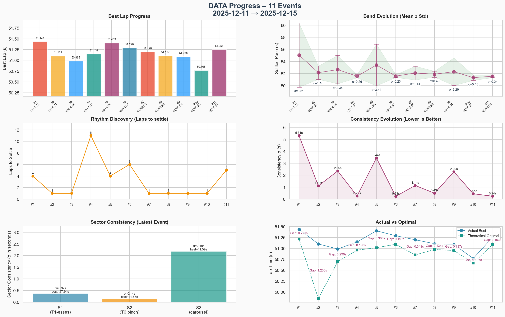
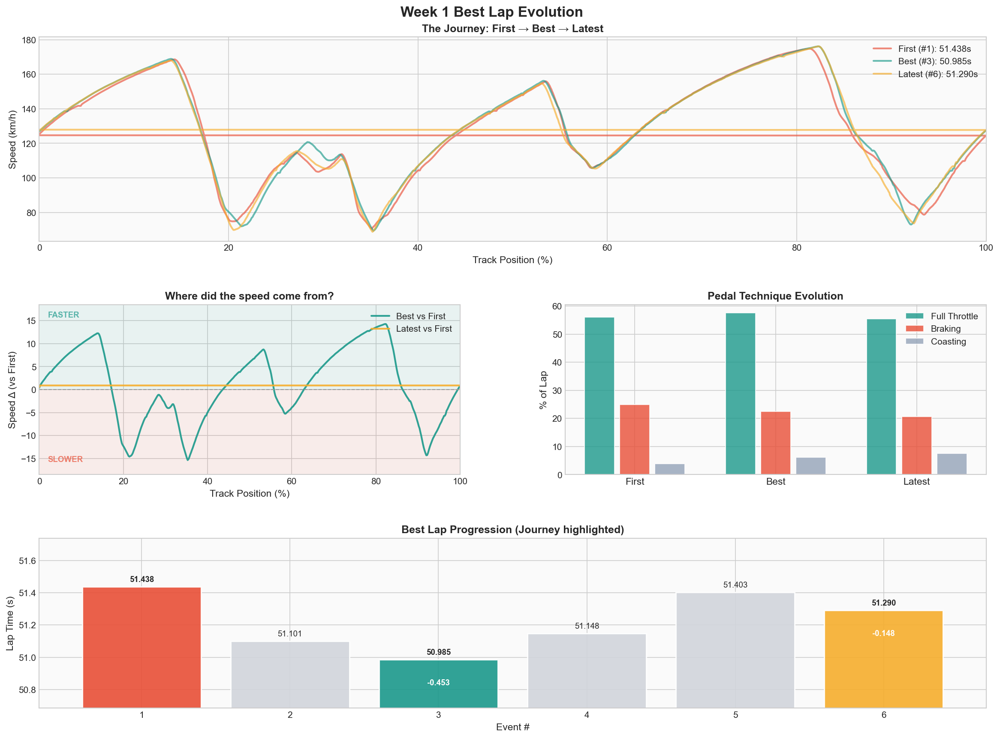

# Week 01 – Summit Point Raceway – Jefferson Circuit

- **Season:** 2026 Season 1
- **Series:** Ray FF1600 Rookie Fixed
- **Schedule:** Dec 10 – Dec 16, 2025
- **Car dossier:** [Ray FF1600](../../cars/car-ray-ff1600.md)
- **Track dossier:** [Summit Point Jefferson Circuit](../../tracks/track-summit-point-jefferson-circuit.md)
- **Intent:** _Keep it smooth. Stay out of the weeds. Focus on transitions. Build rhythm._

## Events

| #   | Date       | Type     | Laps | Best    | σ     | Notes                 | Details                              |
| --- | ---------- | -------- | ---- | ------- | ----- | --------------------- | ------------------------------------ |
| 1   | 2025-12-11 | Practice | 33   | 51.438s | 5.31s | First contact         | [→](events/01-2025-12-11-solo.md)    |
| 2   | 2025-12-11 | Practice | 62   | 51.101s | 1.10s | Finding rhythm        | [→](events/02-2025-12-11-solo.md)    |
| 3   | 2025-12-12 | Practice | 39   | 50.985s | 2.35s | **PB lap** 🏆         | [→](events/03-2025-12-12-solo.md)    |
| 4   | 2025-12-12 | AI Race  | 28   | 51.148s | 0.26s | Race pace!            | [→](events/04-2025-12-12-ai-race.md) |
| 5   | 2025-12-13 | AI Race  | 13   | 51.403s | 3.44s | Patience test         | [→](events/05-2025-12-13-ai-race.md) |
| 6   | 2025-12-13 | AI Race  | 13   | 51.290s | 0.23s | **Patience works** ✅ | [→](events/06-2025-12-13-ai-race.md) |

## Week Progress

### Lap Comparison (Best Laps)

## Summary

- **Events:** 6
- **Best Lap:** 50.985s (Event #3)
- **Best Consistency:** σ 0.23s (Event #6 – patience pays!)
- **Total flying laps:** 188

## Reflection

- **Track craft:** Jefferson rewards smooth transitions. The time comes from filling the gaps between brake and throttle, not from braking later. Use the full track width – edges exist for a reason.
- **Brake bias:** 56.0% still too pointy – rear breaks out in every corner. 54% was worse. → Test 57% next.
- **Mindset:** "Don't chase the time, let it come" worked. Best lap came when not trying.
- **Traffic lesson (Events #5→#6):** Discovered the urge to pass slower cars immediately breaks rhythm. Tested patience: follow for 2 laps, strike clean at T1. Result: σ dropped from 3.44s to 0.23s. Patience isn't optional – it's faster.
- **Gap management:** Replay showed bumping cars in braking zones when following. Need more space cushion – stay out of their braking zone.
- AI race only worked after I treated lap 1–3 as a **survival exercise** instead of a passing contest. Once I did that, the band came back and the race felt calmer.

### Hypothesis Validated ✅

> Follow slower cars for 2 full laps before attempting a pass. Mantra: _"I'm faster. I can wait."_

**Result:** Event #5 (impatient) σ = 3.44s → Event #6 (patient) σ = 0.23s. **15x improvement in consistency!**

### Next Week Intent

- Carry this rhythm to a new track
- Focus on "laps to settle" – can we find pace faster?
- Maintain clean incident count in official races
- Practice patience in traffic – strike clean, not desperate
- Experiment with 57% brake bias for stability
- Consciously use full track width

---

[← Back to Season](../../README.md)
