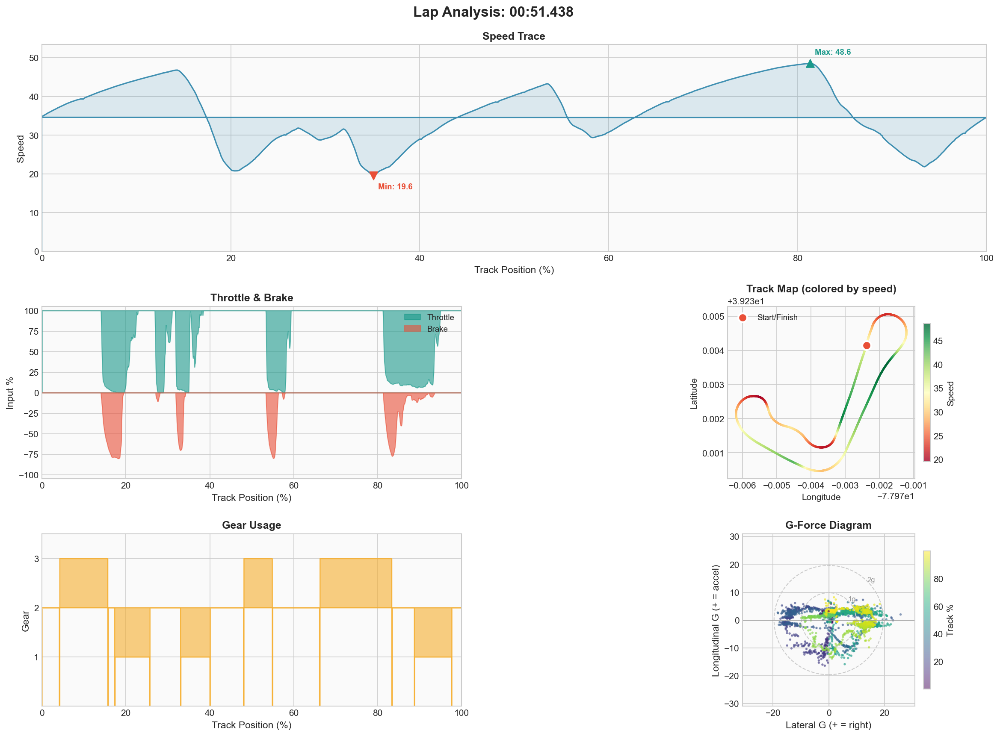

# Event #1 – 2025-12-11 – Solo Practice

[← Back to Week 01](../README.md) | [Garage 61](https://garage61.net/app/event/01KC6TY32JWT4EE4JECKK1D06Q)

## Quick Stats

| Metric              | Value   |
| ------------------- | ------- |
| **Laps**            | 34      |
| **Best Lap**        | 51.438s |
| **Optimal**         | 51.217s |
| **Consistency (σ)** | 5.22s   |
| **Clean Laps**      | 65%     |

## The Facts

- Brake bias: **55.0** (from default 56.0) - 54 too pointy
- 24 laps total across two stints
- Best lap: **51.992** (several clean 52.x laps)
- Stint 1: avg ~55.1s, lots of exploring, many dirty laps
- Stint 2: avg ~54.7s, calmer, laps clustering 52.1–52.5
- Gap to data-pack reference (49.226): **~2.8s**

## The Feelings

- Still in "what the hell is this corner" discovery phase
- Cautious on entries, searching for reference points
- Flashes of "oh, that felt hooked up" in the mid-52s

## Telemetry (Best Lap: 51.438s)

| Metric        | Value                       |
| ------------- | --------------------------- |
| Full throttle | 56.0%                       |
| Braking       | 14.4%                       |
| **Coasting**  | **12.2%** ← room to improve |

### VRS Analysis Notes

- Speed graph: you almost always a little under ref – lift/brake a touch earlier, never quite clawing speed back on exit
- Throttle/brake: you come off throttle earlier, brake sooner/harder, fatter "no man's land" before proper throttle pick-up
- Ref does "brake → turn → go" in one smooth move; you have dead air in between
- Steering: your trace more jagged = still finding the line, making mid-corner corrections where ref draws one clean arc
- **Translation:** the 2.7s gap is almost entirely "sequence and confidence", not missing alien tricks

## Focus for Next Event

1. NOT going faster – aim for 10 clean laps in 52.5–54.0 window
2. Pick two corners (T1 and downhill esses) where delta is biggest
3. Challenge: move lift/brake 1–2 car lengths later without panicking
4. Goal: tighten brake → turn-in → throttle sequence, less "nothing" in between

## Self-Check Question

> "Do my clean laps look like a 'family' (same shape, same times), or is every lap a different improvisation?"

✅ Getting laps to be "siblings, not strangers" = perfect week-1 win, regardless of stopwatch.

---

[← Back to Week 01](../README.md) | [Next Event →](./02-2025-12-11-solo.md)
