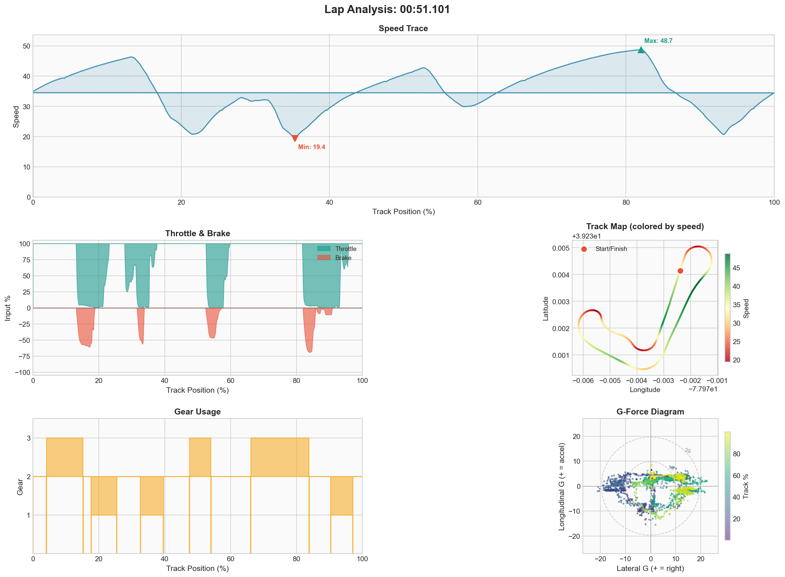

# Event #2 – 2025-12-11 – Solo Practice

[← Back to Week 01](../README.md) | [Garage 61](https://garage61.net/app/event/01KC77TQXJ1PKXE2NKDVN02S4A)

## Quick Stats

| Metric              | Value   |
| ------------------- | ------- |
| **Laps**            | 63      |
| **Best Lap**        | 51.101s |
| **Optimal**         | 49.845s |
| **Consistency (σ)** | 1.10s   |
| **Clean Laps**      | 79%     |

## Big Picture

Your red dotted trace is now basically shadowing the blue instead of wandering off and doing its own thing. The lap shape is a sibling, not a random cousin anymore. A 2.0-ish gap with traces this close means you're no longer "lost", you're just leaving little bits of time on the table in predictable ways.

## What I'm Seeing

On the speed graph you're much closer everywhere, especially through the bottom left section. The big time loss is now really "entry and first half of the long loop" plus the final sector: you still come off the throttle a touch earlier than the ref and you're a bit more decisive on the brake, which buys you comfort but costs you that half-second in each major zone.

The nice thing is that your exits are no longer catastrophically worse; you're simply not quite as early and confident getting back to full power out of the long right and onto the "straight".

The throttle and brake traces are way healthier than before. There's less of that dead air between releasing brake and committing to throttle. You're still a tiny bit "on/off" in places where blue rolls more – especially on the way into and out of the big loop – but the overall pattern is: **you brake once, you turn once, you go once**. That's a big upgrade from the stop-think-go rhythm of the first screenshots.

Steering looks calmer too. Earlier, your line had those mid-corner wiggles; here the red steering angle follows blue quite closely with just the occasional extra nibble at the wheel. That tells me you're trusting your chosen line more and not second-guessing yourself halfway through each corner.

## Telemetry (Best Lap: 51.101s)

| Metric        | Value                  |
| ------------- | ---------------------- |
| Full throttle | 53.4%                  |
| Braking       | 15.4%                  |
| **Coasting**  | **14.5%** ← still high |

## Focus for Next Event

In the long top loop, keep exactly this entry speed, but start bleeding off the brake just a fraction earlier and blend into a whisper of throttle a beat sooner, without changing your steering. Don't "push", just let the car float that tiny bit more.

## Key Question

> "Which single corner, if you could magically fix just the throttle pick-up timing, would give you the biggest free gain?"

---

[← Prev Event](./01-2025-12-11-solo.md) | [Back to Week 01](../README.md) | [Next Event →](./03-2025-12-12-solo.md)
