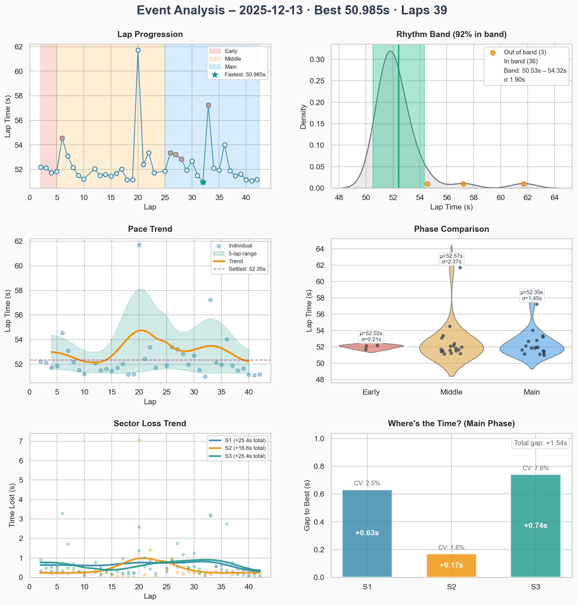
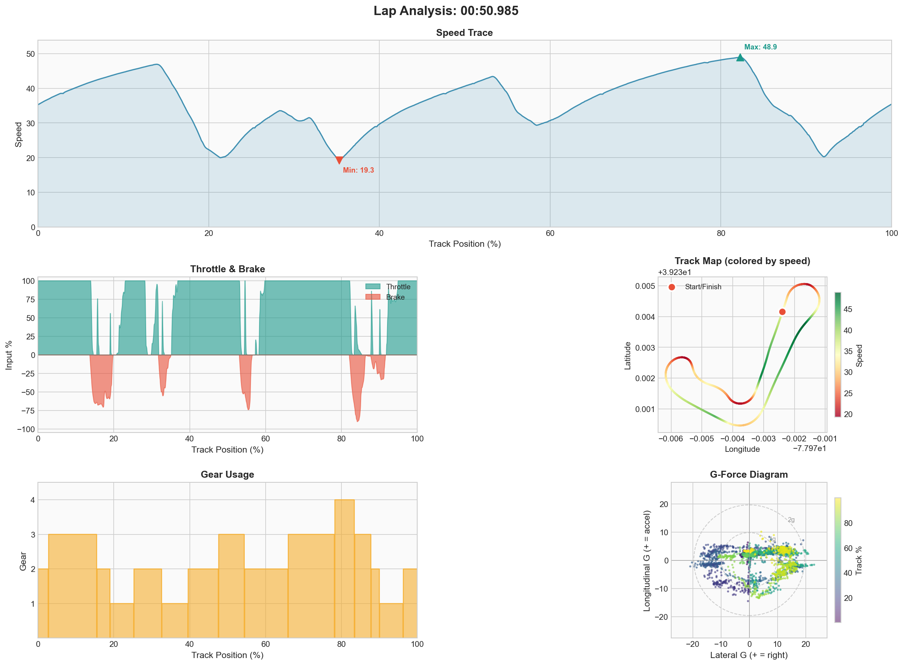

# Event #3 – 2025-12-12 – Solo Practice

[← Back to Week 01](../README.md) | [Garage 61](https://garage61.net/app/event/01KC91RZ4HRHX3PKKK1K6D1W9B)

## Quick Stats

| Metric              | Value         |
| ------------------- | ------------- |
| **Laps**            | 40            |
| **Best Lap**        | 50.985s ⭐ PB |
| **Optimal**         | 50.695s       |
| **Consistency (σ)** | 2.35s         |
| **Clean Laps**      | 85%           |

## The Story

~50 laps total. Band shifted from 51.7–52.7 → **51.0–51.9**.

**Stint 7 poetry:** ten consecutive laps 51.0–51.8. The family is forming.

## Lap Times

## Telemetry (Best Lap: 50.985s ⭐ PB)

| Metric        | Value                 |
| ------------- | --------------------- |
| Full throttle | 57.6%                 |
| Braking       | 18.5%                 |
| **Coasting**  | **6.1%** |

## Key Breakthrough

- First sub-51 lap!
- Optimal down to 50.695s
- Gap to data-pack now under 1.5s
- Coasting dropped to 6.1% - less hesitation in transitions

## Focus for Next Event

- Maintain this rhythm under pressure (AI race)
- Don't chase the time, let it come
- Trust the process

---

[← Prev Event](./02-2025-12-11-solo.md) | [Back to Week 01](../README.md) | [Next Event →](./04-2025-12-12-ai-race.md)
