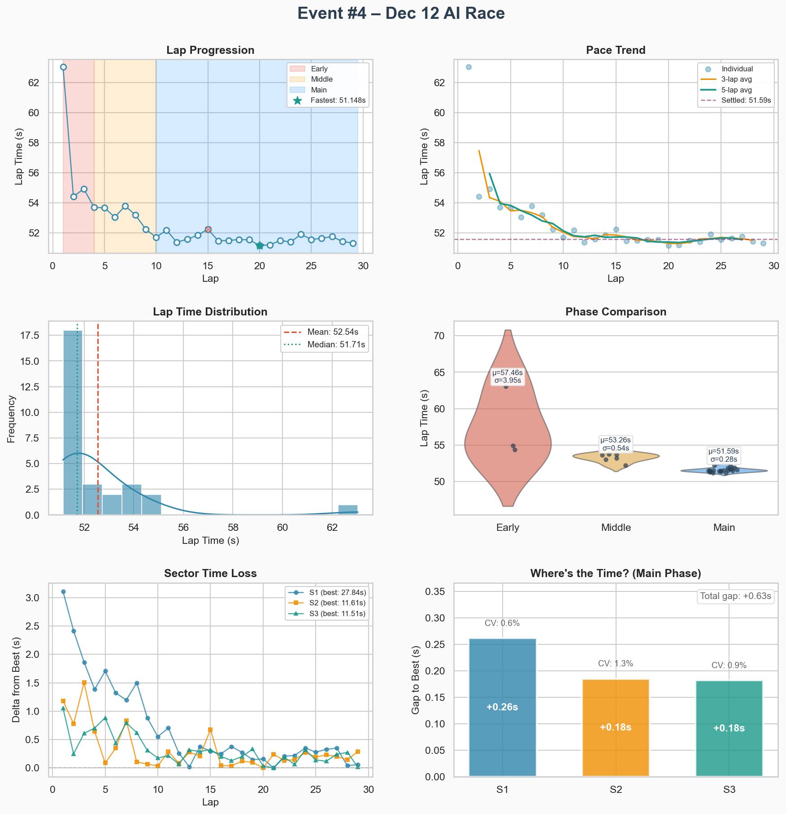
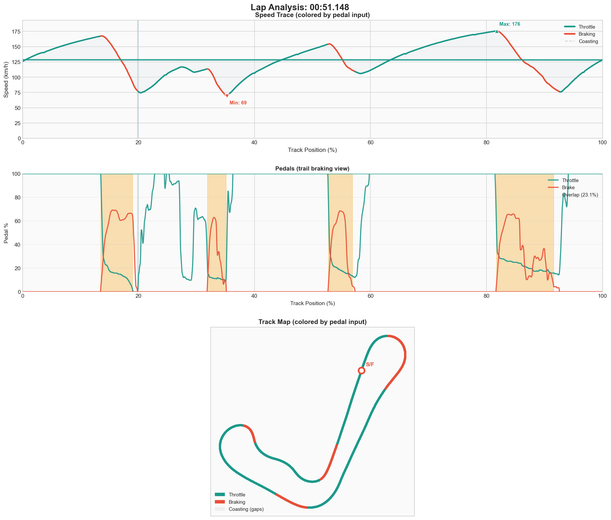

# Event #4 – 2025-12-12 – AI Race (20 min)

[← Back to Week 01](../README.md) | [Garage 61](https://garage61.net/app/event/01KC9R46GMX7DD7SFDAGP14HAV)

## Quick Stats

| Metric              | Value   |
| ------------------- | ------- |
| **Grid**            | P12     |
| **Finish**          | P2 🏆   |
| **Laps**            | 29      |
| **Best Lap**        | 51.148s |
| **Optimal**         | 50.959s |
| **Consistency (σ)** | 0.26s   |
| **Clean Laps**      | 97%     |
| **Incidents**       | 14x 😬  |

## Lap Times

## Telemetry (Best Lap: 51.148s)

| Metric        | Value       |
| ------------- | ----------- |
| Full throttle | 54.6%       |
| Braking       | 22.0%       |
| **Coasting**  | **1.7%** 🏆 |

## The Race

- Started P12, finished P2
- 29 laps, race band ~51.3–51.9 once settled
- 14x incidents (mix of racing contact & lazy off-tracks)
- **Rhythm survived the chaos**

## What Worked

- Maintained pace under pressure
- σ of 0.26s = incredibly consistent
- 97% clean laps despite traffic
- Best race lap only 0.16s off best practice lap

## What Needs Work

- 14x incidents is too many
- Some lazy track limits
- Need cleaner overtakes

## Key Insight

> The settled pace (51.5s) in race conditions was almost identical to practice. The skill transferred. Now it's about cleaning up the rough edges.

---

[← Prev Event](./03-2025-12-12-solo.md) | [Back to Week 01](../README.md)
