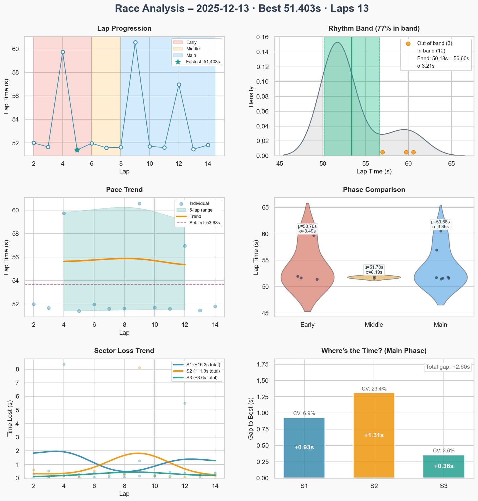
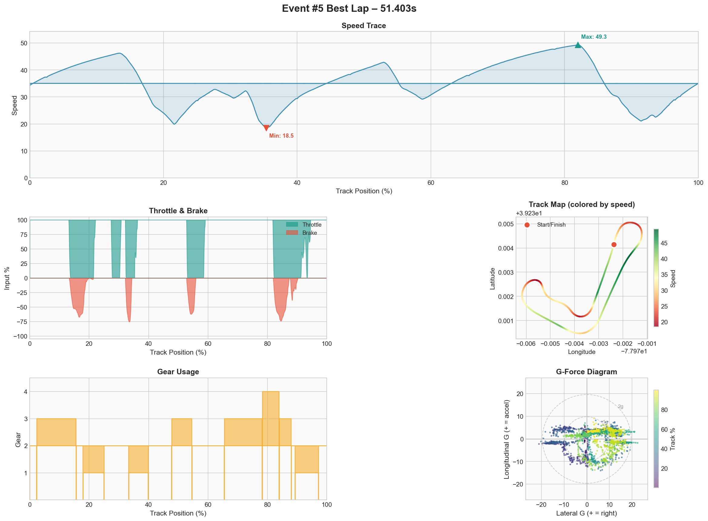

# Event #5 – 2025-12-13 – ai-race

[← Back to Week 01](../README.md) | [Garage 61](https://garage61.net/app/event/01KCC2F9C555J1H1NAPCEMCBY2)

## Quick Stats

| Metric              | Value   |
| ------------------- | ------- |
| **Laps**            | 13      |
| **Best Lap**        | 51.403s |
| **Optimal**         | 51.403s |
| **Settled Pace**    | 53.256s |
| **Consistency (σ)** | 3.44s   |
| **Clean Laps**      | 100%    |

## Lap Times

## Best Lap Telemetry

| Metric            | Value |
| ----------------- | ----- |
| **Full throttle** | 60.1% |
| **Braking**       | 16.2% |
| **Coasting**      | 10.2% |
| **Max lateral G** | 2.29g |

## Debrief

**The Facts:**

- 13 flying laps, best 51.403s (0.4s off PB)
- Consistency fell apart: σ 3.44s vs σ 0.26s in previous race
- Coasting increased to 10.2% - hesitation in transitions

**The Feelings:**

- Felt erratic throughout
- Strong urge to pass slower cars immediately, even unsafely
- Realized I was driving THEIR lap, not MY lap
- Impatience breaking my rhythm

**Key Insight:**

> "I find it hard to just follow... I need to pass, but do that unsafely."

This is an experience/patience thing, not a pace thing. The speed is there (60% full throttle), but the decisions around traffic cost time.

**Hypothesis to Test (Next Event):**

1. Follow slower cars for 2 full laps before attempting a pass
2. Mantra: _"I'm faster. I can wait."_
3. Only pass at T1 inside - it's the only safe zone on this track

**Focus for Next Event:**

1. Patience around traffic - breathe, learn their weakness, strike clean
2. Drive MY lap, not theirs

---

[← Back to Week 01](../README.md)
