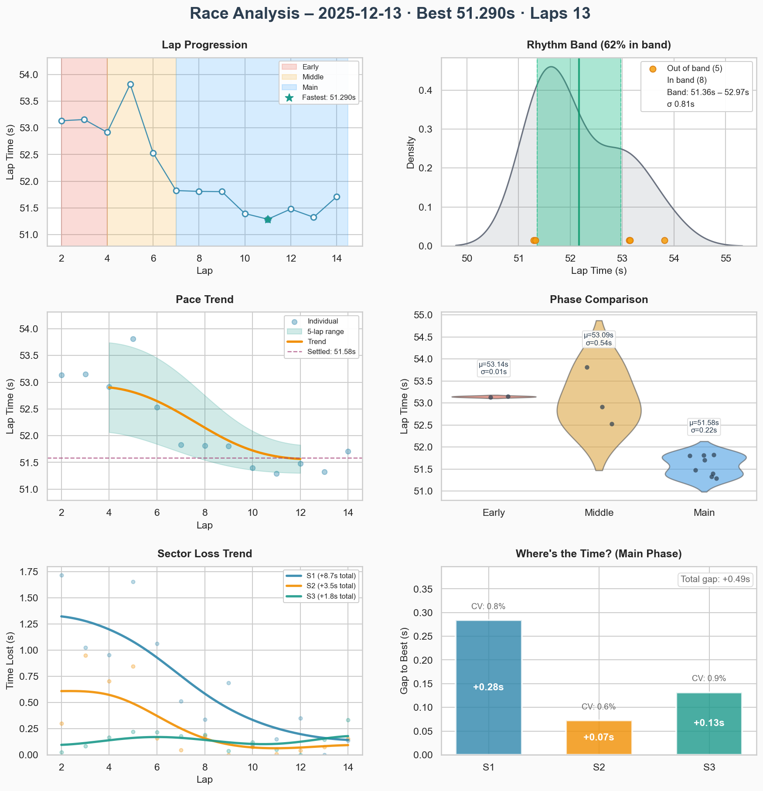
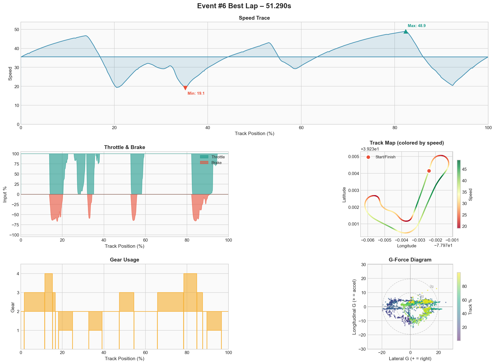

# Event #6 – 2025-12-13 – AI Race

[← Back to Week 01](../README.md) | **[Garage 61 Event Page](https://garage61.net/app/event/01KCC9HGJ8MYP2YH1E0AH49DES)**

## Quick Stats

| Metric              | Value   |
| ------------------- | ------- |
| **Laps**            | 13      |
| **Best Lap**        | 51.290s |
| **Optimal**         | 51.093s |
| **Settled Pace**    | 51.687s |
| **Consistency (σ)** | 0.23s   |
| **Clean Laps**      | 93%     |

## Lap Times

## Best Lap Telemetry

| Metric            | Value |
| ----------------- | ----- |
| **Full throttle** | 55.4% |
| **Braking**       | 18.1% |
| **Coasting**      | 7.5% |
| **Max lateral G** | 2.57g |

## Debrief

**The Facts:**

- 13 flying laps, best 51.290s (−0.113s vs Event #5)
- Consistency restored: σ 0.23s (vs σ 3.44s in Event #5!)
- Coasting dropped from 10.2% to 7.5% - less hesitation

**The Feelings:**

- Felt calmer throughout
- Sometimes lifted a little to create space from car in front – tactical, not reactive
- Planned moves at T1, but also got a free one at T6 inside (opportunity appeared)
- **Restarted 3 times** before this run – recognized kamikaze mode creeping in and chose to reset
- Conscious decision to mentally stay in the race, not force it

**Hypothesis Result:**

> **VALIDATED** ✅ Following for 2 laps before passing restored rhythm.
> σ went from 3.44s → 0.23s (15x improvement!)

**Key insight:** The restarts weren't failure – they were _self-correction_. Recognizing "I'm falling into old patterns" and choosing to reset is a skill.

**Replay Review (post-race):**

Three things spotted on replay:
1. **Gap management:** Still bumping cars in braking zones – need more space cushion when following
2. **Brake bias:** 56% still too pointy. Rear breaks out in every corner and looks unstable. → Try 57%
3. **Track usage:** Not using the full width. Staying too far from track edges = leaving grip on the table

**Focus for Next Event:**

1. Keep the patience mindset
2. Leave more space when following – stay out of their braking zone
3. Experiment with 57% brake bias
4. Use ALL the track – edges exist for a reason
5. See if this transfers to official races with real drivers

---

[← Prev Event](./05-2025-12-13-ai-race.md) | [Back to Week 01](../README.md)
