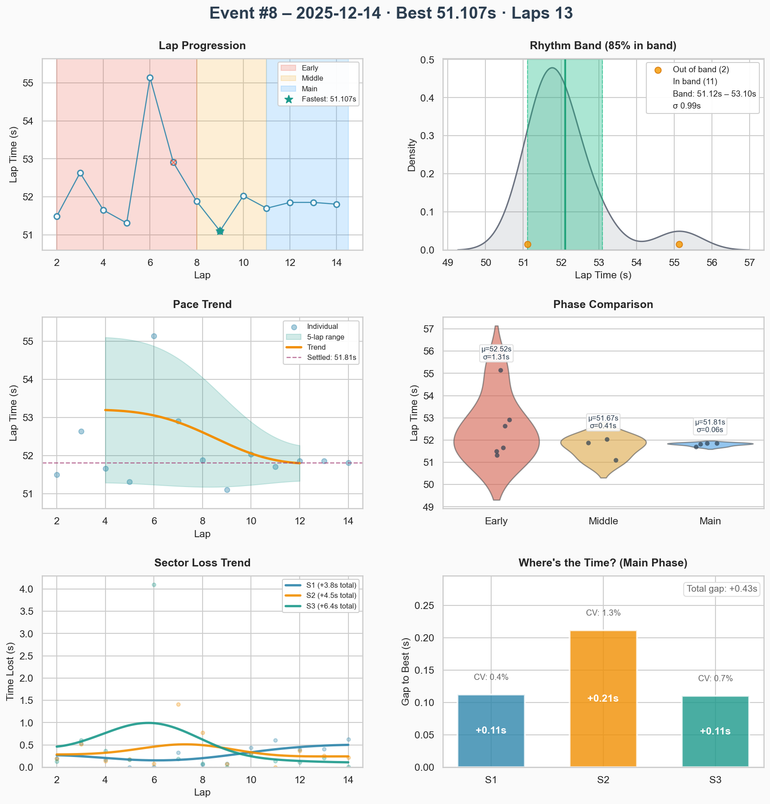
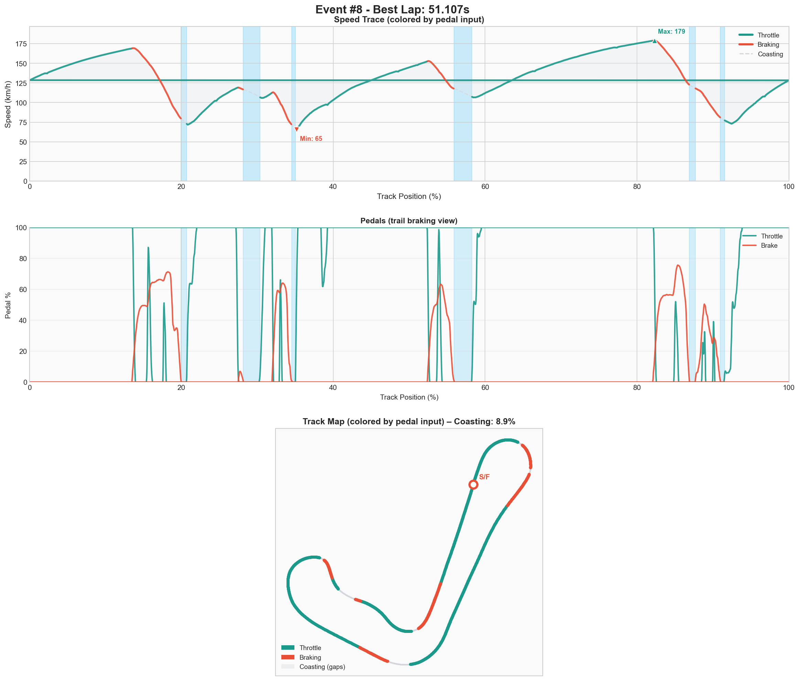

# Event #8 – 2025-12-14 – ai-race

[← Back to Week 01](../README.md)

## Quick Stats

| Metric              | Value   |
| ------------------- | ------- |
| **Laps**            | 13      |
| **Best Lap**        | 51.107s |
| **Optimal**         | 51.107s |
| **Settled Pace**    | 51.895s |
| **Consistency (σ)** | 1.03s   |
| **Clean Laps**      | 100%    |

## Lap Times

## Telemetry Analysis

### Pedal Usage

- Full throttle: 61.3%
- Braking: 21.1%
- Coasting: 8.9%

## Debrief

**The Facts:**

- _What happened objectively?_

**The Feelings:**

- _How did it feel? Confidence? Flow?_

**Focus for Next Event:**

1. _First priority_
2. _Second priority_

---

[← Back to Week 01](../README.md)
