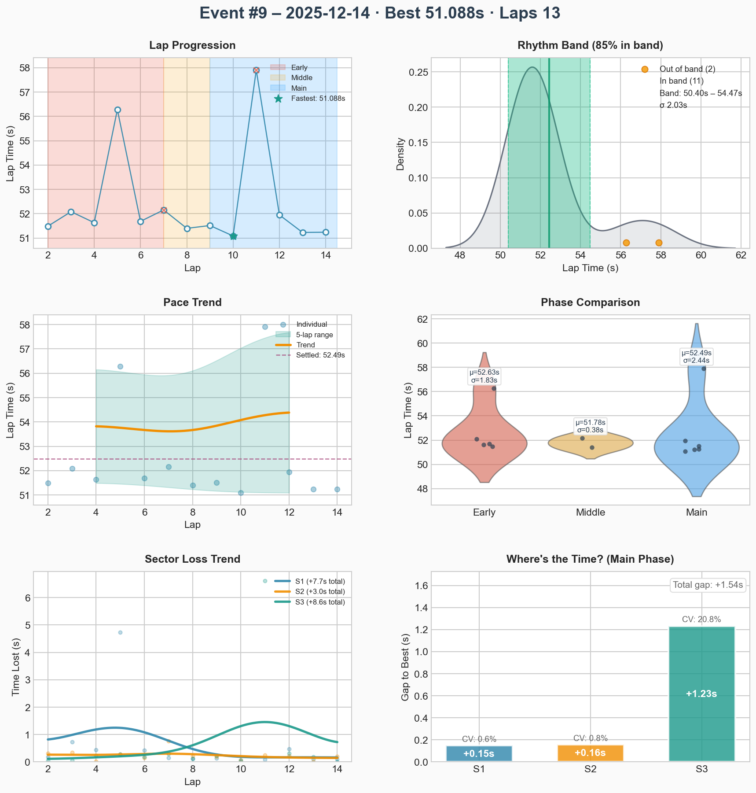
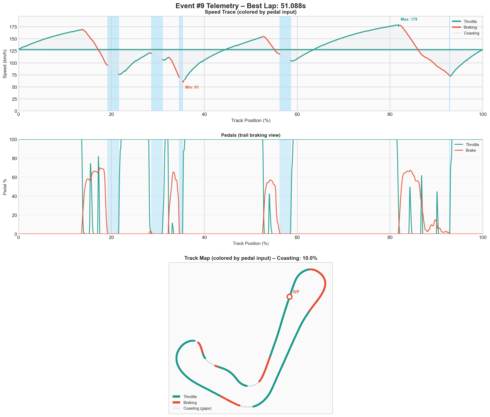

# Event #9 – 2025-12-14 – ai-race

[← Back to Week 01](../README.md) | **[Garage 61 Event Page](https://garage61.net/app/event/01KCESDF8E6BBKTR502ST612ST)**

## Quick Stats

| Metric              | Value   |
| ------------------- | ------- |
| **Laps**            | 13      |
| **Best Lap**        | 51.088s |
| **Optimal**         | 51.088s |
| **Settled Pace**    | 52.311s |
| **Consistency (σ)** | 2.12s   |
| **Clean Laps**      | 85%     |

## Lap Times

## Telemetry Analysis

### Pedal Usage

- Full throttle: 62.5%
- Braking: 23.5%
- Coasting: 10.0%
  
## Debrief (Coach Little Wan 🤖)

**The Facts:**

- 13 laps in the bag.
- Best lap: **51.088s** (getting faster!).
- Consistency was a bit "meh" at 2.12s sigma.
- 85% clean laps... we had a few moments there, Master.

**The Feelings:**

- **Little Wan says:** "Master Lonn! We are fast, yes! But we are also a bit wild today! 10% coasting? Are we sightseeing? The pace is good, but let's keep it on the black stuff, okay?"

**Focus for Next Event:**

1. **Consistency!** Let's smoothen out those inputs.
2. **Focus!** 100% clean laps is the way of the Jedi.

---

[← Back to Week 01](../README.md)
