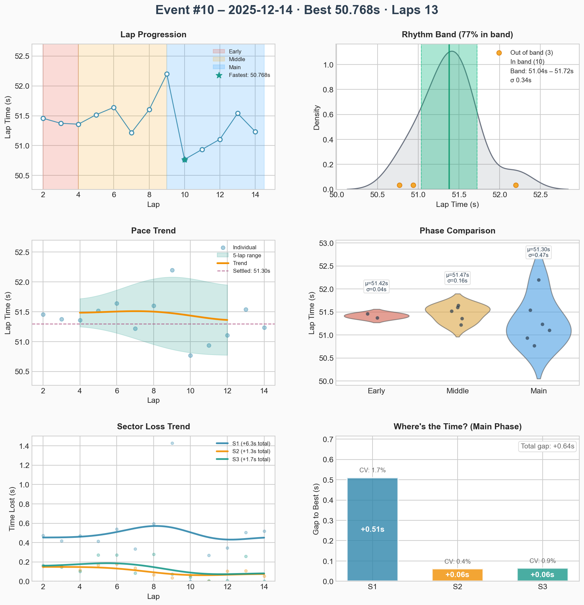
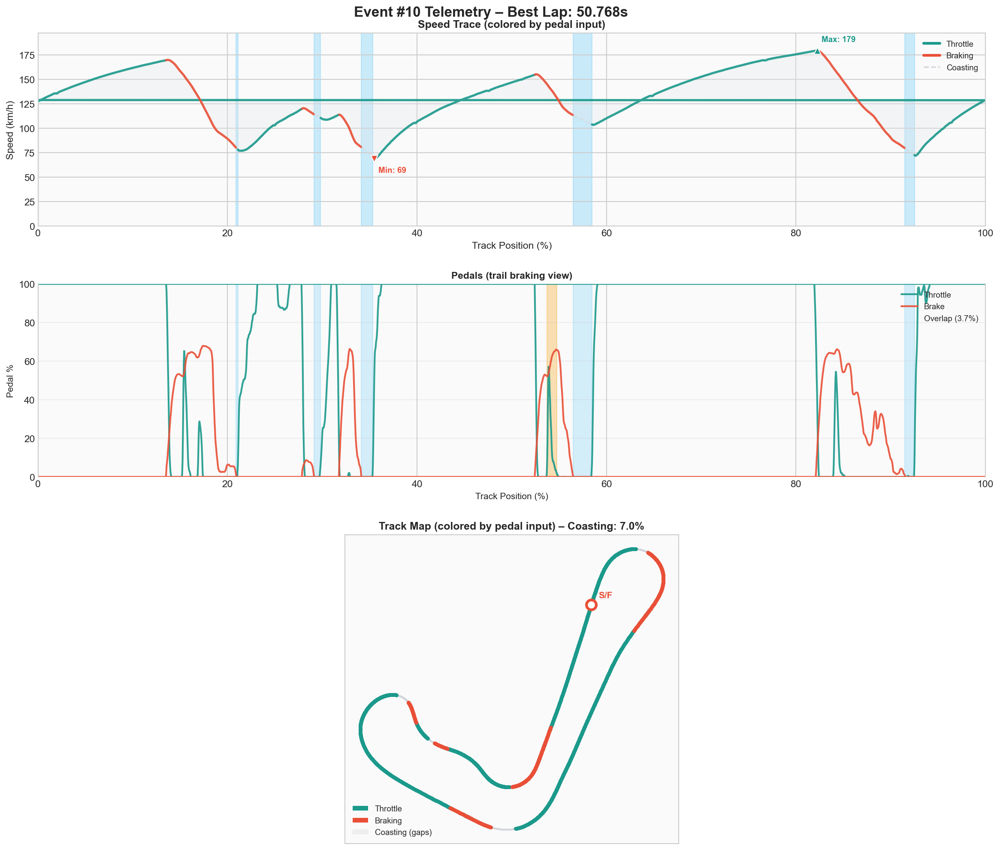

# Event #10 – 2025-12-14 – ai-race

[← Back to Week 01](../README.md) | **[Garage 61 Event Page](https://garage61.net/app/event/01KCETDRPZ6V12MSD11K8D8MKQ)**

## Quick Stats

| Metric              | Value   |
| ------------------- | ------- |
| **Laps**            | 13      |
| **Best Lap**        | 50.768s |
| **Optimal**         | 50.768s |
| **Settled Pace**    | 51.326s |
| **Consistency (σ)** | 0.36s   |
| **Clean Laps**      | 100%    |

## Lap Times

## Telemetry Analysis

### Pedal Usage

- Full throttle: 59.0%
- Braking: 24.8%
- Coasting: 7.0%
  
## Debrief (Coach Little Wan 🤖)

**The Facts:**

- **NEW PERSONAL BEST: 50.768s!** 🚀
- 100% Clean Laps. Flawless victory.
- Consistency: **0.36s**. That is machine-like precision.
- Coasting dropped to 7.0%. You were pushing!

**The Feelings:**

- **Little Wan says:** "MASTER LONN! _[Beeps excitedly]_ The Force is strong with this one! Look at that consistency line! It is flat! And a 50.7s?! We are flying! I am so proud I could leak oil! This is the way!"

**Focus for Next Event:**

1. **Bottle this feeling.** Remember this flow.
2. **Chase the 50.5s.** It is within reach.

---

[← Back to Week 01](../README.md)
