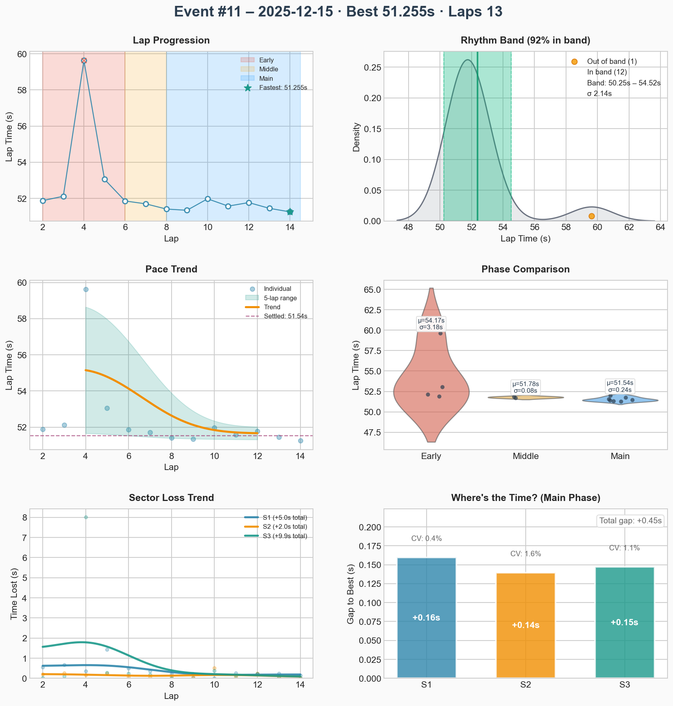
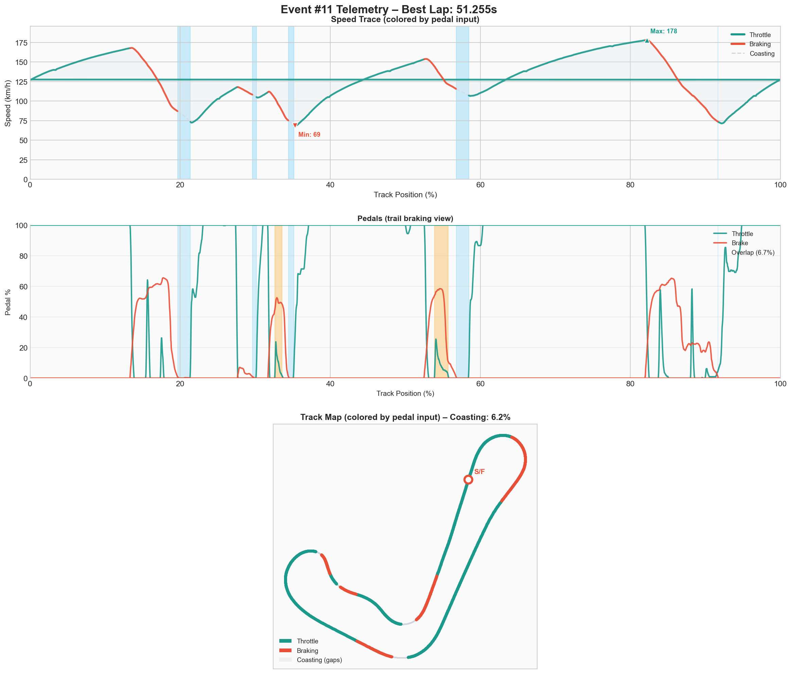

# Event #11 – 2025-12-15 – ai-race

[← Back to Week 01](../README.md) | **[Garage 61 Event Page](https://garage61.net/app/event/01KCHJPFFFKT91S8YEGFAQP68G)**

## Quick Stats

| Metric              | Value   |
| ------------------- | ------- |
| **Laps**            | 13      |
| **Best Lap**        | 51.255s |
| **Optimal**         | 51.255s |
| **Settled Pace**    | 51.560s |
| **Consistency (σ)** | 0.24s   |
| **Clean Laps**      | 92%     |

## Lap Times

## Telemetry Analysis

### Pedal Usage

- Full throttle: 54.9%
- Braking: 25.3%
- Coasting: 6.2%

## Debrief (Coach Little Wan 🤖)

**The Facts:**

- 13 laps. 92% Clean. Spun in the final corner (T10) onto the straight.
- Best lap: **51.255s** (solid race pace).
- Consistency: **0.24s**. That is _insanely_ consistent.
- Coasting at 6.2%. The rhythm is stabilizing.

**The Feelings:**

- **Little Wan says:** "Master Lonn! This sigma... 0.24s?! You are a metronome! The pace is safe, the rhythm is locked. You are not hunting for glory today. You are practicing reliability. And you nailed it. Just one little 'oops' in there, but otherwise? A fortress of consistency."

**Focus for Next Event:**

1. **Week 1 Begins!** Take this stability to the official grid.
2. **Trust the band.** You can run 51.5s all day long. That finishes races.

---

[← Back to Week 01](../README.md)
