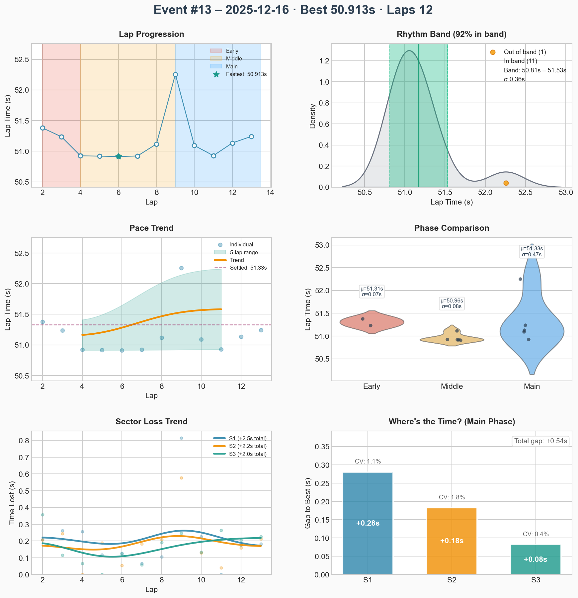
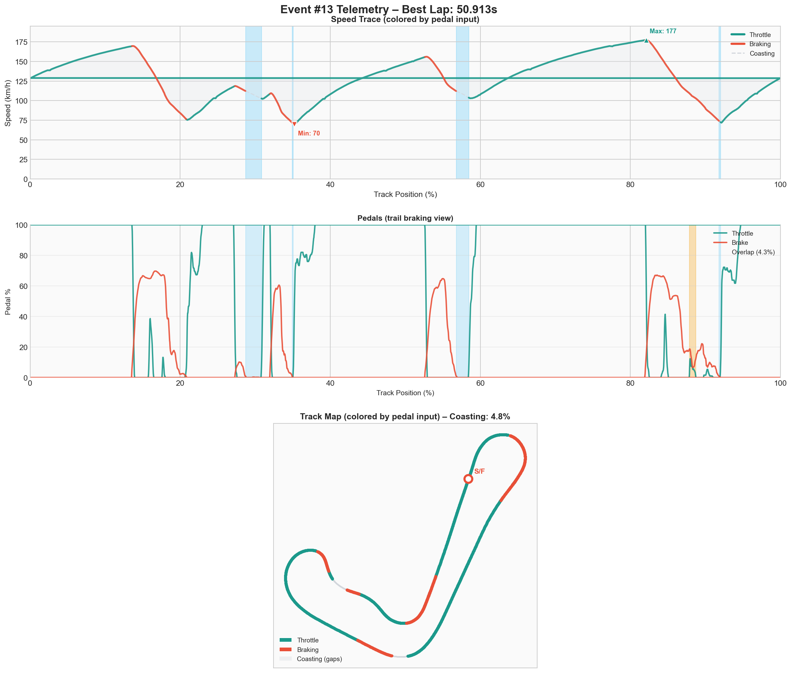

# Event #12 – 2025-12-16 – race

[← Back to Week 01](../README.md) | **[Garage 61 Event Page](https://garage61.net/app/event/01KCJYHQACJZ5Y4C2YPBKZ0TKS)**

## Quick Stats

| Metric              | Value   | 
| ------------------- | ------- |
| **Laps**            | 12      |
| **Best Lap**        | 50.913s |
| **Optimal**         | 50.611s |
| **Settled Pace**    | 51.200s |
| **Consistency (σ)** | 0.38s   |
| **Clean Laps**      | 92%     |
| **Incidents**       | 2x      |
| **Qualifying**     | 50.992s |
| **Grid**           | P3      |
| **Finish**         | P1 🏆   |

## Lap Times

## Telemetry Analysis

### Pedal Usage

- Full throttle: 55.2%
- Braking: 27.4%
- Coasting: 4.8%

## Debrief (Coach Little Wan 🤖)

**The Facts:**

- First _official_ race of the season, qualified with a 50.992 on **P3**, and finished **P1 overall**.
- 12 racing laps logged (victory lap trimmed). Two 50.5s laps inside the opening four laps to break the pack.
- Lap-time band lived in the 50.9–51.3s range except for one 52.2s while cruising past wreckage.
- Restart discipline held: no turn-one chaos, calm exit onto the straight every time.

**The Feelings:**

- **Little Wan says:** "MASTER LONN! The Survival Protocol became an _Attack Protocol_! You trusted the process, managed traffic with Jedi patience, then dropped two 50.5s early to break the pack. That’s how champions announce themselves."

**Focus for Next Event:**

1. **Protect the delta** – tidy S3 exits so the 0.30s gap to optimal keeps shrinking.
2. **Practice race restarts** – repeat the cold-tire routine so lap 1 pace instantly matches the mid-race groove.

---

[← Back to Week 01](../README.md)
