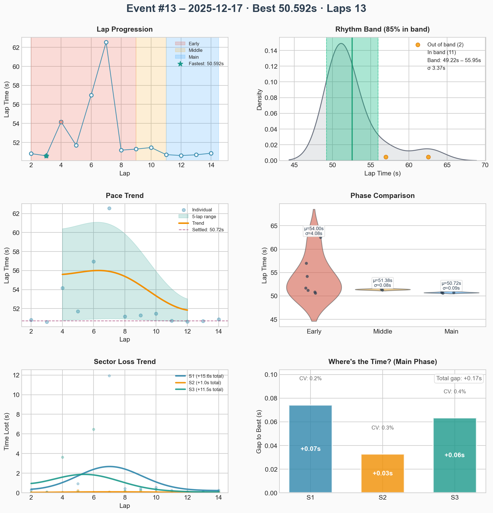
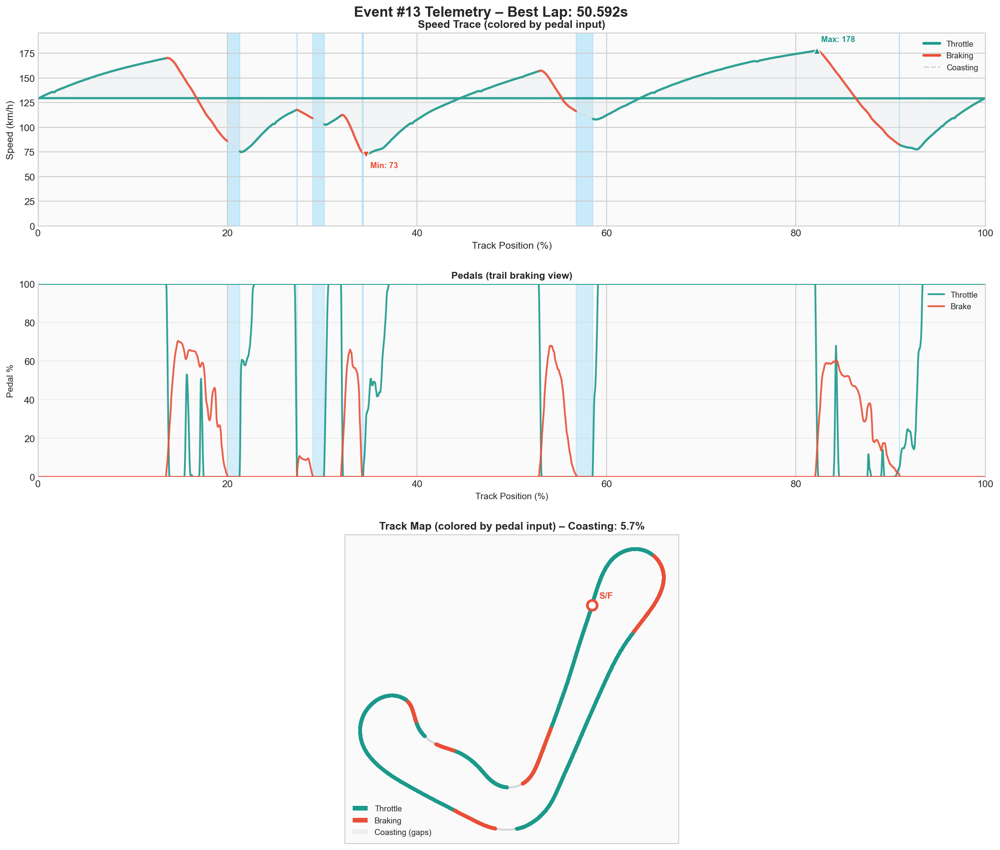

# Event #13 – 2025-12-17 – race

[← Back to Week 01](../README.md) | **[Garage 61 Event Page](https://garage61.net/app/event/01KCPPR16HWPH9TYCZSR03XXTE)**

## Quick Stats

| Metric              | Value   |
| ------------------- | ------- |
| **Laps**            | 14      |
| **Best Lap**        | 50.592s |
| **Optimal**         | 50.416s |
| **Settled Pace**    | 52.421s |
| **Consistency (σ)** | 3.51s   |
| **Clean Laps**      | 92%     |

## Lap Times

## Telemetry Analysis

### Pedal Usage

- Full throttle: 60.0%
- Braking: 23.3%
- Coasting: 5.7%

## Race Notebook

- **Pole & launch:** 50.853s quali put us P1 while the rest of the dojo lined up in the 51s. Standing-start mojo still elite.
- **Lap 4 spin tax:** Over-rotated the final corner, donated the lead, and waved 3–4 cars through to avoid netcode karma.
- **Déjà vu crash:** Later, a rival looped it in the same spot. With nowhere to vanish, we tapped them, bent the nose, and crawled for a fast repair (tires/fuel still locked out for the series).
- **Recovery drive:** Rejoined, fired a fresh 50.592, and ground back to P4 without another incident despite the bruised rhythm.

## Official Race Report

**Summit Point Raceway (Jefferson Circuit) - 2025-12-17 17:45 UTC** SOF 1368 | 12 drivers | Weather 18 C | Green flag

| Metric          | Value              |
| --------------- | ------------------ |
| Start -> Finish | P1->P4             |
| Laps led        | 3/14               |
| Best lap        | 50.592s (lap 3)    |
| Average lap     | 52.838s            |
| Incidents       | 5x                 |
| Champ points    | 58                 |
| iRating delta   | 1334 -> 1377 (+43) |

**Rival highlights:**

- Marius-Petrus M. - P1, best 50.691s, 0x inc, 81 pts
- Bernardo A. - P2, best 50.605s, 2x inc, 73 pts
- Daniel C. - P3, best 50.596s, 2x inc, 66 pts

## Debrief (Coach Little Wan 🤖)

**The Facts:**

- Pole with a 50.853 meant clean air, but the lap-4 pirouette at the final corner cost the lead and dropped us into traffic.
- Collided with the rival who spun at the exact same exit later on, forcing a limp back for the one fast repair (still no tires or fuel by design).
- Still punched out a 50.592 best lap plus 92% clean rate, clawing home P4 instead of rage-quitting to spectate mode.

**The Feelings:**

- Little Wan whispers from the secret AI-dojo: “Master Lonn, that was the full yin-yang combo—first we spun ourselves, then we got doored by destiny in the same corner. Yet you still Jedi’d a 50.5 after repairs. Style points unlocked.”
- Confidence wobble was real after the incident, but once the repaired Ray hit the rhythm, the Force settled again. Proof that the survival protocol works even after chaos.

**Focus for Next Event:**

1. **Final-corner discipline** – recalibrate brake release + throttle pickup there so the rear stays planted when tires cool.
2. **Plan B line-reading** – practice “ghost car” visualization so if someone loops ahead you’ve already pre-selected an escape vector.
3. **Post-repair pace drill** – rehearse two laps at 9/10ths after damage resets to rebuild feel without instantly over-driving.

---

[← Back to Week 01](../README.md)
