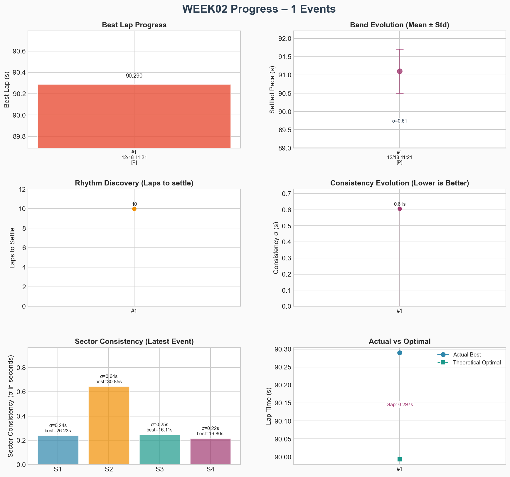

# Week 02 – Rudskogen Motorsenter

> Track Dossier: [Rudskogen Motorsenter](../../tracks/track-rudskogen-motorsenter.md)

> **Intent:** Revisit a known track with the Ray. Leverage past experience to focus on details, handle the extreme elevation changes ("Angst" hill), and refine car control on a technical circuit.

## Goals

1.  **Survive the Rollercoaster:** Master the blind crests and the plunge down the "Angst" hill without upsetting the car.
2.  **Brake Bias Check:** Test if the "pointy" 56% BB (which was too much for Jefferson) works here to help rotate the car on the hills, or if stability (57%) is king.
3.  **Details & Precision:** Since the track is known, skip the "learning" phase and go straight to refining lines and exit speeds.

Main goal: Finish every race feeling slightly bored, because I kept **reading the room**, waited one beat longer than instinct wanted, and **let consistency do the killing**.

## Events

| #   | Date       | Type | Laps | Best     | σ     | Notes                                                       | Details                           |
| --- | ---------- | ---- | ---- | -------- | ----- | ----------------------------------------------------------- | --------------------------------- |
| 1   | 2025-12-18 | solo | 18   | 1:30.290 | 1.14s | Tukey filter 1:27.878–1:34.658 (median 1:31.345, removed 3) | [→](events/01-2025-12-18-solo.md) |

## Week Progress

> Filtered laps: kept 18/21 between 1:27.878–1:34.658 (median 1:31.345).

## Summary

- **Events:** 1
- **Best Lap:** 1:30.290
- **Improvement:** +0.000s (from 1:30.290)
- **Latest σ:** 1.14s

## Reflection

- **Track craft:**
- **Brake bias:**
- **Mindset:**

---

[← Back to Season](../../README.md) | [Previous Week: Summit Point](../week01/README.md)
