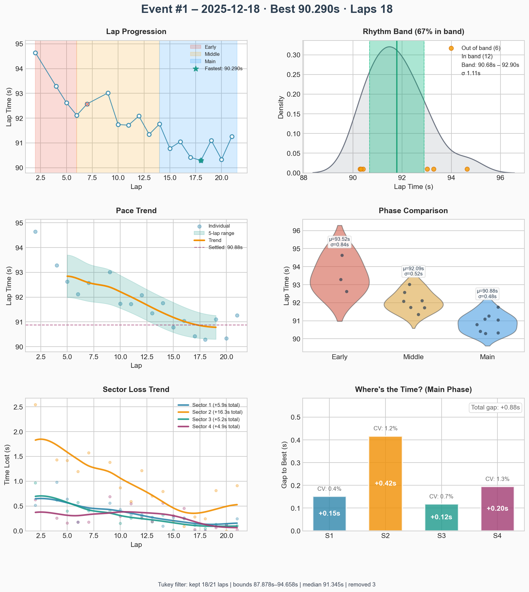
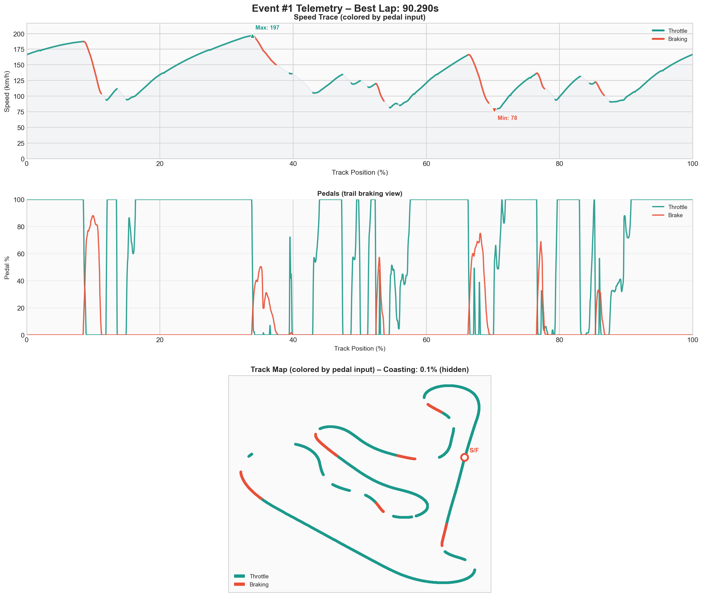

# Event #1 – 2025-12-18 – solo

[← Back to Week 02](../README.md) | **[Garage 61 Event Page](https://garage61.net/app/event/01KCRK32Y4NS51XV5GCTZM0FGH)**

## Quick Stats

| Metric              | Value          |
| ------------------- | -------------- |
| **Laps**            | 18       |
| **Best Lap**        | 90.290s      |
| **Optimal**         | 90.290s   |
| **Settled Pace**    | 91.105s   |
| **Consistency (σ)** | 1.14s     |
| **Clean Laps**      | 94% |

> Tukey filter applied: kept 18/21 laps (median 91.345s, bounds 87.878s–94.658s, removed 3). (dropped laps: 8, 22, 23)

## Lap Times

## Telemetry Analysis

### Pedal Usage

- Full throttle: 52.8%
- Braking: 12.3%
- Coasting: 0.1%
  

## Debrief

**The Facts:**

- _What happened objectively?_

**The Feelings:**

- _How did it feel? Confidence? Flow?_

**Focus for Next Event:**

1. _First priority_
2. _Second priority_

---

[← Back to Week 02](../README.md)
